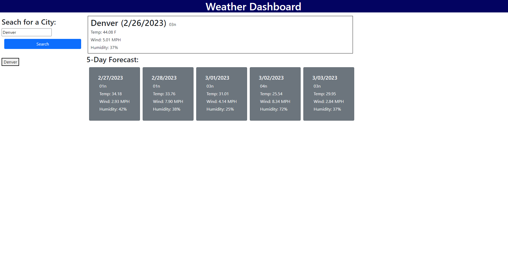

# Server Side API Challenge (Module 6)

## Description

-This project was aimed at developing a weather forecasting application.

-The application uses Open Weather API.

-Upon searching for a US city, the User is presented with current weather data for the searched city.

-The User is also provided with weather data for the following 5 days for the searched city.

-Buttons are created for previously searched cities.

## Usage

https://anuffisenough.github.io/Server_Side_API_Challenge/

### Screenshot

### Credits

![MDN Web Docs] https://developer.mozilla.org/en-US/docs/

